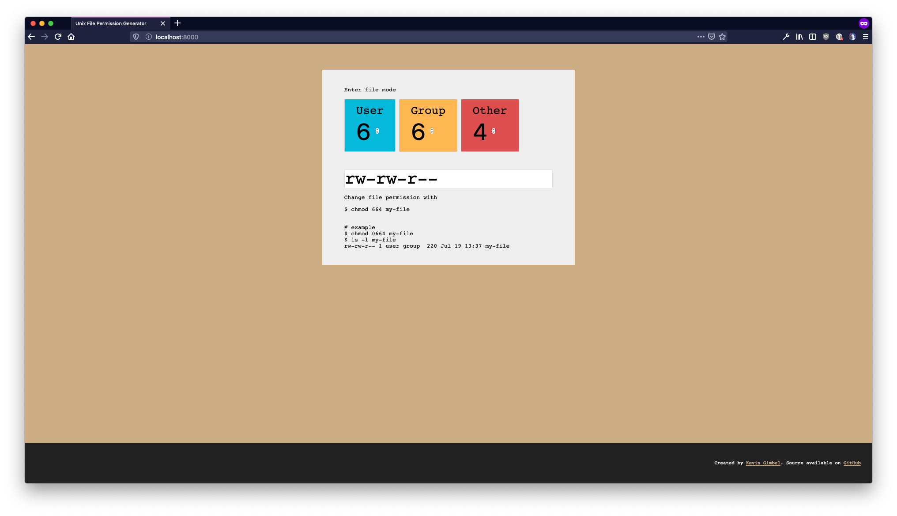

# unix permission generator
> Generate unix file permission in octal (`0755`) or text (`rwxr-xr-x`) format

<!-- BEGIN mktoc -->
- [Usage](#usage)
- [Screenshot](#screenshot)
- [Development](#development)
  - [Setup dev environment](#setup-dev-environment)
  - [Make changes](#make-changes)
- [Contributing](#contributing)
- [License](#license)
<!-- END mktoc -->

## Usage

This "web app" generates unix file permission strings from octal or text based inputs. It also converts back-and-forth, so if you want to see `rwxr-xr-x` in octal notion just enter it and see the number on top change.

## Screenshot



## Development

### Setup dev environment

1. Install dev dependencies

```sh
$ npm install
```

2. Run dev task
```sh
$ npm run dev
```

3. Run local web server, e.g. using Python

```sh
$ python -m SimpleHTTPServer
```

### Make changes

Change files in `src` directory. This app is written in [VueJS](https://vuejs.org). The CSS is written in plain CSS. 

## Contributing

You are free to contribute by forking and creating pull requests or opening issues. 

## License

MIT, See LICENSE file.